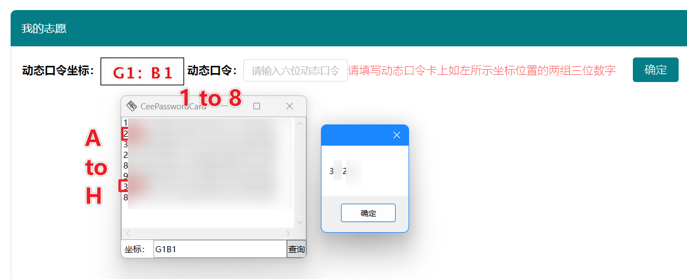

## CeePasswordCard
高考动态口令卡辅助查询工具
根据江苏地区对动态口令卡的使用习惯制作

## 屏幕截图


## 使用说明
1. 在与exe同目录的文件下，新建“data.txt”，填入动态口令卡上的所有数据（建议使用支持表格识别的OCR网页，很方便），格式如下：
   ```
   <A1> <A2> ...
   <B1> <B2> ...
   ...
   ```
2. 打开程序，数据坐标，点击“查询”，即可快速查询